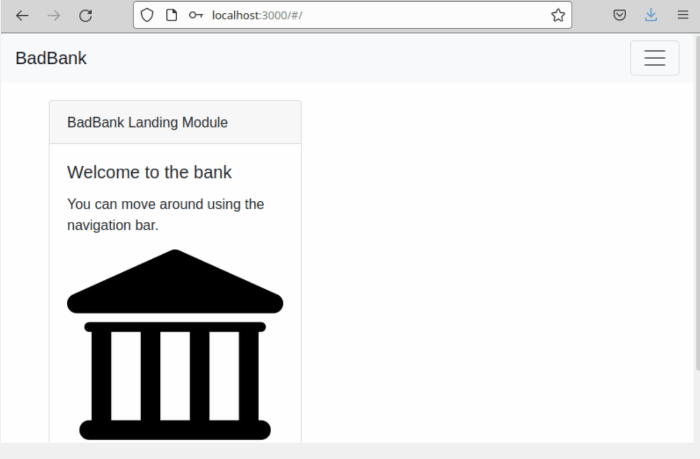

This is a project created following the MIT X Pro curriculum.

This project can be ran by cloning or downloading source code from Github. Running npm init and installing package.json dependencies.

Below is a GIF of the application demonstrating its functionality by creating an account, depositing funds, checking the balance, and finally checking all the user data that is stored.

